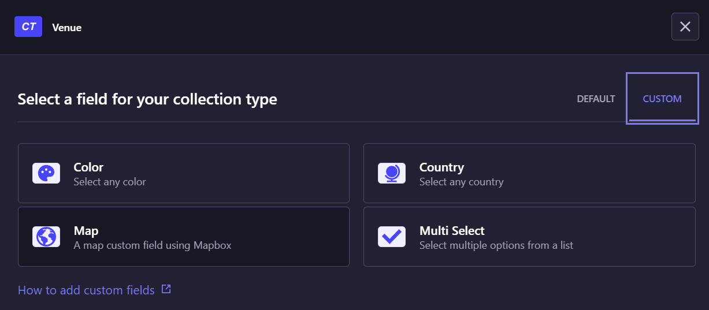

# Strapi plugin `map-field`

The `map-field` [Strapi](https://strapi.io/) plugin allows to add a [Mapbox](https://www.mapbox.com/) map custom field in your content-types. 


You can use the seach box to pinpoint the location you are looking for. Alternatively, you can double-click anywhere on the map, which will put a marker on the closest geolocated point.

The address, longitude and latitude of the geolocated point are displayed in the readonly fields underneath the map.

The field will actually be stored as [GeoJSON](https://geojson.org/) in a JSON field behing the scene.

```js
{
  "id": "address.7351440929350024",
  "text": "Avenue Des Hauts-Fourneaux",
  "type": "Feature",
  "center": [
    5.949249,
    49.50255
  ],
  "address": "9",
  "context": [
    {
      "id": "postcode.13299336",
      "text": "4364"
    },
    {
      "id": "place.1271944",
      "text": "Esch-sur-Alzette",
      "wikidata": "Q16010"
    },
    {
      "id": "region.9352",
      "text": "Esch-sur-Alzette",
      "wikidata": "Q188283",
      "short_code": "LU-ES"
    },
    {
      "id": "country.8840",
      "text": "Luxembourg",
      "wikidata": "Q32",
      "short_code": "lu"
    }
  ],
  "geometry": {
    "type": "Point",
    "coordinates": [
      5.949249,
      49.50255
    ]
  },
  "relevance": 0.735,
  "place_name": "9, Avenue Des Hauts-Fourneaux, 4364 Esch-sur-Alzette, Luxembourg",
  "place_type": [
    "address"
  ],
  "properties": {
    "accuracy": "rooftop"
  }
}
```

This plugin was inspired by
* [Customizing fields in the Strapi admin panel by Cyril Lopez](https://www.youtube.com/watch?v=55KJ2sCX8ws)
* [How to Create a Custom Admin UI Field Component in Strapi](https://medium.com/@dallasclark/how-to-create-a-custom-admin-ui-field-component-in-strapi-2c9cd367f262)
* [Custom fields in Strapi documentation](https://docs.strapi.io/developer-docs/latest/development/custom-fields.html)

It uses the following npm packages
* [mapbox-gl](https://www.npmjs.com/package/mapbox-gl)
* [react-map-gl](https://www.npmjs.com/package/react-map-gl)
* [@mapbox/mapbox-sdk](https://www.npmjs.com/package/@mapbox/mapbox-sdk)
* [@mapbox/mapbox-gl-geocoder](https://www.npmjs.com/package/@mapbox/mapbox-gl-geocoder)

## Install the plugin

To install this plugin, you need to add an NPM dependency to your Strapi application:

```sh
# Using Yarn
yarn add strapi-plugin-map-field

# Or using NPM
npm install strapi-plugin-map-field
```

## Configure the plugin

You need to enable the plugin in your Strapi plugins configuration.

Open `config/plugins.js` and add the following:

```js
// config/plugins.js
module.exports = ({ env }) => ({

  ...

  "map-field": {
    enabled: true,
  },

  ...

});

```

## Update the security middleware configuration

In order for the map to be displayed properly, you will need to update the `strapi::security` middleware configuration.

For that, open `config/middlewares.js` and add the directive `'worker-src': ['blob:']` to the `contentSecurityPolicy` directives under `strapi::security`. You also need to add `api.mapbox.com` in the `script-src`.

The whole file should look somewhat like this:
```js
module.exports = ({
  env
}) => [
  'strapi::errors',
  {
    name: 'strapi::security',
    config: {
      contentSecurityPolicy: {
        useDefaults: true,
        directives: {
          'connect-src': ["'self'", 'https:'],
          'script-src': ["'self'", "'unsafe-inline'", 'cdn.jsdelivr.net', 'api.mapbox.com'],
          'img-src': ["'self'", 'data:', 'blob:' ],
          'media-src': ["'self'", 'data:', 'blob:'],
          'worker-src': ['blob:'],
          upgradeInsecureRequests: null,
        },
      }
    },
  },
  'strapi::cors',
  'strapi::poweredBy',
  'strapi::logger',
  'strapi::query',
  'strapi::body',
  'strapi::session',
  'strapi::favicon',
  'strapi::public',
];
```


## Provide a valid Mapbox Access Token

Add a valid [Mapbox Access Token](https://docs.mapbox.com/help/getting-started/access-tokens/) as an environment variable in your `.env` file

```bash
# .env
STRAPI_ADMIN_MAPBOX_ACCESS_TOKEN=pk.xxxxxxxxxxxxxxxxxxxxxxxxxxxxxxxxxxxxxxxxxxxxxxxxxxxxxx.xxxxxxxxxxxxxxxxx

```


## Add a map field to your content type

In the content type builder
* Click on `Add another field`
* Select the `Custom` tab
* Select the `Map` field
* Type a name for the field
* Click `Finish`


